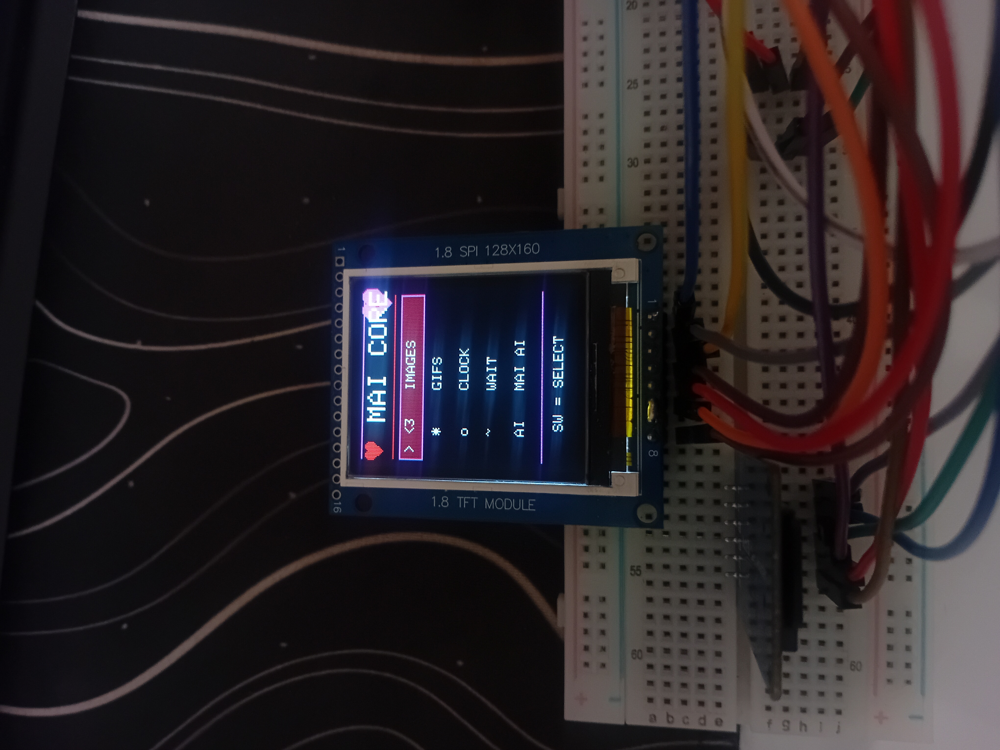
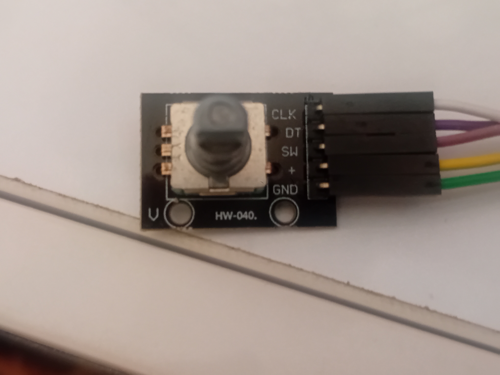
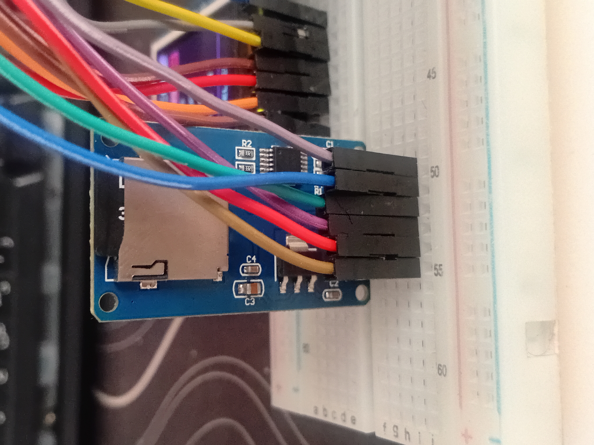

# MAI Core

<p align="center">
  
</p>

<p align="center">
  <b>A custom ESP32-based personal core system.</b><br>
  TFT UI • Media System • Wi-Fi • Web Dashboard • Hardware Control
</p>

<p align="center">
  
  
  
  
</p>

---

## About

**MAI Core** is a personal embedded-system project built around an **ESP32**.

It started as a simple TFT and media experiment and gradually evolved into a more complete system with a custom interface, Wi-Fi connectivity, SPIFFS storage, a web dashboard, hardware controls, and an expanding software architecture.

This repository contains the development of MAI Core across its major versions.

> **The first official public release is MAI Core v1.0.**

---

## Features

### Hardware

* ESP32 Dev Module
* ST7735 128×160 TFT display
* Rotary encoder
* SD storage
* GPIO-controlled hardware

### Software

* Custom ESP32 firmware
* SPIFFS-based storage
* Image playback
* GIF/media playback
* Wi-Fi Station mode
* Wi-Fi Access Point mode
* Embedded web dashboard
* System information API
* File manager
* File upload
* File deletion
* Remote LED control
* Remote restart
* Boot / initialization screen
* Custom TFT interface

---

## Hardware

### TFT Display

<p align="center">
  
</p>

### Rotary Encoder

<p align="center">
  
</p>

### SD Storage

<p align="center">
  
</p>

---

## V1.0

### MAI Core v1.0 — First Official Release

The first version of MAI Core established the foundation of the entire project.

### Included in v1.0

* ESP32 firmware
* ST7735 TFT initialization
* Basic boot screen
* SPIFFS media system
* Image playback
* GIF playback
* Wi-Fi connectivity
* Access Point mode
* Web dashboard
* System API
* Network API
* Media control API
* File listing API
* File upload API
* File deletion API
* LED control API
* Remote restart API

### V1.0 Architecture

```text
                    MAI CORE
                       │
                     ESP32
                       │
        ┌──────────────┼──────────────┐
        │              │              │
       TFT           SPIFFS          Wi-Fi
        │              │              │
    UI / Media     Web Files       Dashboard
        │              │              │
        └──────────────┼──────────────┘
                       │
                    HTTP API
                       │
        ┌──────────────┼──────────────┐
        │              │              │
      System         Files          Media
        │              │              │
      Network       Upload/Delete    Play
```

---

## Project Evolution

MAI Core has evolved through several major versions:

```text
v1.0
 │
 ├── ESP32 + TFT
 ├── Boot System
 ├── Media Player
 ├── SPIFFS
 └── Web Dashboard
      │
      ▼
v2.0
      │
      ▼
v2.1
      │
      ▼
v2.2
 ├── Rotary UI
 ├── Menu System
 ├── Media Navigation
 └── Additional Screens
      │
      ▼
v2.3
 └── Latest Stable
      │
      ▼
v2.4
 └── Beta / Development
```

### Version Status

| Version  | Status                 |
| -------- | ---------------------- |
| **v1.0** | Stable                 |
| **v2.0** | Stable                 |
| **v2.1** | Stable                 |
| **v2.2** | Stable                 |
| **v2.3** | **Latest Stable**      |
| **v2.4** | **Beta / Development** |

---

## Project Structure

```text
MAI-Core/
│
├── Mai-Core.ino
├── README.md
├── .gitignore
│
├── data/
│   ├── index.html
│   ├── style.css
│   └── script.js
│
└── docs/
    └── images/
        ├── Rotary.jpg
        ├── SD.jpg
        └── menu-tft.jpg
```

---

## Getting Started

### Requirements

* ESP32 board
* Arduino IDE
* ST7735-compatible TFT display
* Required ESP32 / Arduino libraries
* SPIFFS support

### Installation

1. Clone the repository.

```bash
git clone https://github.com/nobody-miyabi-suki/MAI-Core.git
```

2. Open the project in Arduino IDE.

3. Install the required libraries.

4. Select the correct ESP32 board.

5. Configure the hardware pins.

6. Upload the firmware.

7. Upload the contents of `data/` to SPIFFS.

8. Connect the TFT and other hardware.

9. Power on MAI Core.

---

## Development

MAI Core is an actively evolving personal project.

The architecture and hardware are expected to change between major versions as new ideas and components are introduced.

The current development path is:

```text
v1.0
  ↓
v2.0
  ↓
v2.1
  ↓
v2.2
  ↓
v2.3 Stable
  ↓
v2.4 Beta
```

---

## Roadmap

Future development may include:

* More advanced TFT UI
* Improved menu navigation
* Expanded hardware support
* Better media management
* System monitoring
* More modular firmware
* AI integration
* Additional sensors and peripherals
* More advanced web control
* Expanded MAI Core architecture

---

## Repository

**GitHub:**
https://github.com/nobody-miyabi-suki/MAI-Core

**Latest Stable:** `v2.3`

**Current Beta:** `v2.4`

---

## License

No open-source license is currently declared for this repository.

Until a license is added, the source code should be considered copyrighted and is **not automatically available for unrestricted reuse, modification, or redistribution**.

---

<p align="center">
  Built with ESP32, Arduino, hardware experiments, and a lot of debugging.
</p>

<p align="center">
  <b>MAI Core — from a simple ESP32 prototype to a personal core system.</b>
</p>
